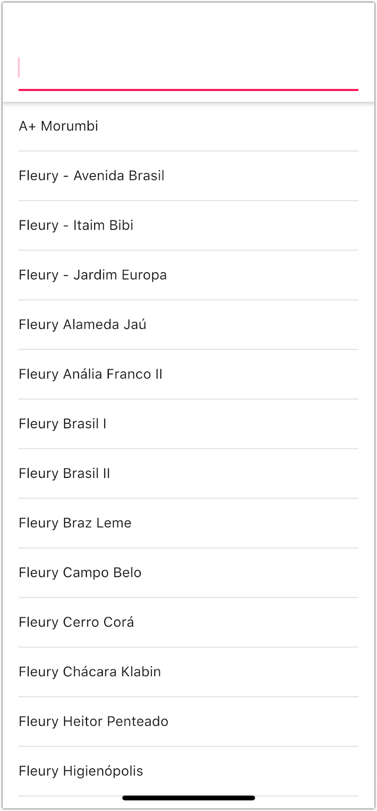
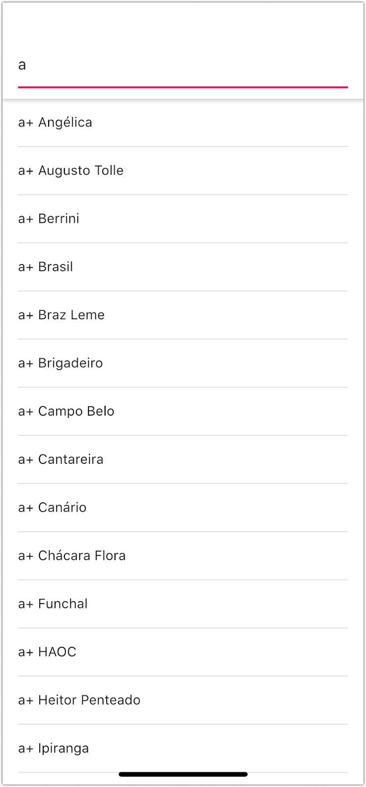
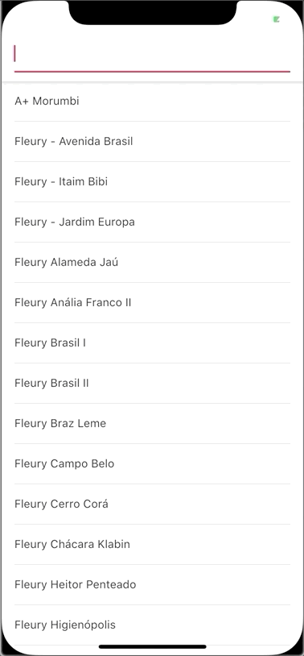

# Alice - Mobile hiring challenge

  
  

## Contexto

O time de produto da Alice quer construir uma primeira versão da nossa busca de rede. Inicialmente, o usuário deve conseguir ver a lista de prestadores da rede (médicos, laboratórios, hospitais), além de poder buscar por prestador utilizando um campo de texto aberto.

Para o nosso MVP a busca será bem simples, apenas fazendo o match do termo buscado com o início do nome de cada prestador (case sensitive).

Mais para frente pretende-se evoluir essa busca para que o match seja mais robusto e as possibilidades de resultados mais abrangentes.

Para o MVP nosso time de design construiu os seguintes exemplos

  

| Estado inicial | Exemplo de busca | Animação de inserção |

|---|---|---|

|  |  |  |

  
  

## Requisitos técnicos

* Plataforma: a que se sentir mais confortável entre iOS nativo, Android nativo e Flutter

* Fonte de dados: você deve copiar o arquivo providers.json para o seu projeto e consumi-lo localmente.

* Ao obter novos resultados da busca, as alterações devem ser animadas. Inserções / remoções devem acontecer apenas para os elementos necessários da lista (ver gif). Se um elemento já está listado, não deve se animar.

* Apesar de ser um requisito de UI, não foque muito na animação. Seu algoritmo e estruturas de dados utilizadas para permitir a animação, fazendo a diferença entre as listas, são mais importantes do que o efeito final.

* Como este é um ponto importante da avaliação, sugerimos não utilizar nenhuma dependência externa neste ponto. Utilize diretamente uma destas APIs de lista: [iOS](https://developer.apple.com/documentation/uikit/uitableview/insertrows%28at:with:%29) / [Android](https://developer.android.com/reference/androidx/recyclerview/widget/RecyclerView.Adapter#notifyItemChanged%28int%29) / [Flutter](https://api.flutter.dev/flutter/widgets/AnimatedList-class.html)

* Você deve testar unitariamente todas as partes da solução que julgar importante.

* A listagem deve sempre seguir a ordem original do json.

* A sua solução deve ser pensada para facilitar a evolução da feature.

  
  

## Nice to have:

* Utilizar Flutter 😅

* Separar a solução em módulos.

  

## Entrega:

* Crie um repositório privado no GitHub com a sua solução.

* [JSON](json/providers.json) com a estrutura de dados

* De acesso ao seu repositório privado no GitHub para os usuários [renancacao](https://github.com/renancacao), [eviceconti](https://github.com/eviceconti), [letportela](https://github.com/letportela) e [diegolechado](https://github.com/diegolechado).